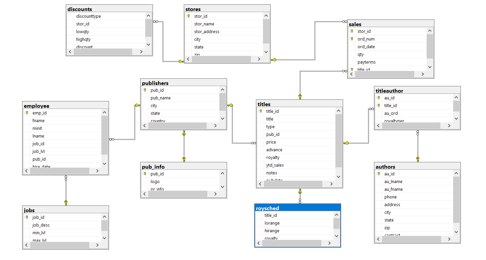

# Pubs database

In this project, I designed and executed a series of SQL queries to explore and analyze the pubs database. The main objective was to extract insightful information about the database's structure and content while improving in my SQL skills
